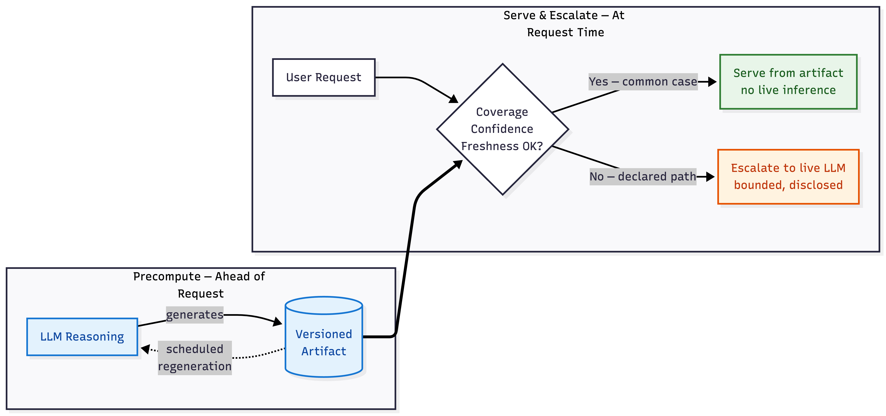

# Precomputed AI: Reason Ahead of Time, Serve Instantly

*A design pattern for moving LLM reasoning into artifacts produced ahead of time, with live inference reserved for declared escalation paths.*

---

A few weeks ago I wrote about [Token Consumption Anxiety](https://dev.to/regnard/token-consumption-anxiety-is-real-26je) — that creeping unease when you watch your AI-powered app burn through tokens, and every user request makes the bill a little bigger.

In that post, I suggested three ways to deal with it. I've been sitting with that idea for a while now. It's bigger than a footnote in an anxiety post. It's the pattern behind every AI tool I've shipped this year.

So I'm giving it a proper name and a proper frame.

Call it **Precomputed AI**, or **PAI** for short.

---

## What it is

**Precomputed AI is an artifact-first LLM architecture. A model is used before request time to transform a bounded domain into a versioned, testable artifact. At request time, the application serves through that artifact without live inference, and escalates to a live model only when declared coverage, confidence, freshness, or ambiguity conditions fail.**

Three words: *precompute, serve, escalate.*

If you've used Next.js static export, Jekyll, or Hugo, the shape will feel familiar. Those tools generate pages at build time and serve them instantly at request time, falling back to dynamic rendering only when they have to. PAI applies the same idea to LLM reasoning.

The artifact doesn't have to be a web page. It can be a decision ruleset. A lookup table. Generated code. A precomputed explanation. A policy surface. What matters is where the reasoning lives — not on the user's request, but ahead of it.

PAI is not a new algorithm. It is a systems pattern: use LLMs where their reasoning is valuable, but move that reasoning into versioned artifacts whenever the domain is stable enough to serve without live inference.

---

## What it is not

PAI gets confused with several adjacent ideas. It shouldn't be.

**It's not caching.** A cache stores identical outputs keyed on identical inputs. PAI precomputes reasoning across an *input space* — a decision surface that covers many cases, not a lookup of past answers.

**It's not prompt or context caching.** Prompt caching reduces prefill cost for repeated prompt prefixes, but the final answer is still generated by a live model on every request. PAI removes the live call from the served path entirely.

**It's not batch inference.** Netflix precomputing your movie recommendations overnight is a decades-old pattern on prediction models. PAI is about LLM reasoning specifically. The word "precomputed" is shared, but the thing being precomputed is different.

**It's not routing or cascades.** Routing decides *which* model handles the request. PAI removes the model from the request path altogether.

**It's not Compiled AI.** A recent paper from XY.AI Labs, Stanford, Cornell, and Harvard defines Compiled AI as LLM-generated code artifacts that run deterministically without further model invocation. That's one valid technique inside PAI, but PAI is broader. It admits non-code artifacts, and it keeps escalation as a first-class option.

PAI also sits *above* implementation tooling like DSPy, LMQL, and guidance. Those are ways to author and optimize prompts and programs. PAI is the design frame that decides where the resulting reasoning lives — at request time, or ahead of it.

I recognize this is not a blanket frame that applies to every situation. PAI fits best where the input space is bounded and the reasoning is stable enough to precompute — rules-based systems, deterministic paths, decisions that don't need to be re-derived on every request.

---

## Required properties

Every PAI system has three required properties. Without all three, you have something simpler — a static dataset, a hand-written rule engine, or a prompt cache.

**1. A versioned artifact.** The output of ahead-of-time LLM reasoning lives in an inspectable, diffable, testable form. It has an ID, a generation timestamp, and a known input schema.

**2. A regeneration cadence.** The artifact has a refresh policy — hourly, daily, weekly, or triggered by an external event. This addresses the issue of "Won't your ruleset go stale?" Yes, unless you regenerate it. Name the cadence. Show the last-refreshed date. Define the freshness window.

**3. A declared escalation path.** When the artifact can't decide — novel input, low confidence, expired freshness — the system escalates to a live LLM. Escalation is *declared*: documented, gated, and bounded. In user-facing tools, the most legible form is opt-in with disclosed cost. In enterprise systems, escalation may be policy-based, budget-gated, or admin-approved. The contract is the same; the surface differs.

The artifact form itself is open. Rulesets, tables, generated code, precomputed text, policy surfaces, routing maps — all admissible. PAI asks *where reasoning lives*, not *what shape it takes*.

---

## Patterns

Three named patterns currently have shipped proof. Each is a way of applying the required properties to a real system.

**Ruleset Compilation.** The LLM writes a decision table ahead of time, and your app reads it. RightModel is the canonical example.

**Scheduled Generation.** The artifact refreshes on a schedule. Like a newspaper, not a livestream. CloudEstimate's pricing pipeline is the canonical example of the serving architecture.

**Heuristic-First, LLM-Escalated.** A simple rule handles the easy cases. The LLM only gets pulled in when the rule can't decide. RightModel's confidence threshold is the canonical escalation gate.

---

## Two tools shipped under this frame

**[rightmodel.dev](https://rightmodel.dev)** is a model picker for coding tasks. It uses a precomputed ruleset to recommend the cheapest model tier that fits the job. Prices are refreshed on a schedule. Explanations are precomputed per recommendation.

A request to RightModel costs zero tokens. The ruleset decides; the page renders.

When the ruleset can't decide, the user can opt into a "deep analysis" that escalates to a live LLM. The cost is disclosed before the user commits. That's the escalation contract in production.

RightModel is the canonical full-PAI example: precomputed ruleset, scheduled regeneration, declared escalation path. All three required properties met.

**[cloudestimate.dev](https://cloudestimate.dev)** sizes self-managed workloads across AWS, Google Cloud, and Microsoft Azure. Published vendor reference architectures are mapped to cloud instance tables, then priced against cached regional snapshots. The "Pricing data last refreshed" footer shows the staleness window directly to the user.

CloudEstimate demonstrates the same serving architecture as RightModel — a static artifact between scheduled refreshes — but LLM-mediated regeneration is on the roadmap, not yet in production. I label it honestly: a PAI-adjacent scheduled artifact today, full PAI once LLM reasoning is part of the regeneration pipeline.

---

## When PAI fits

PAI is the right frame when:

- the input space is bounded or classifiable;
- the reasoning changes slower than request frequency;
- most requests fall into repeatable cases;
- low latency or cost predictability matters;
- auditability matters;
- the artifact can declare what it doesn't cover;
- regeneration can be tested.

## When PAI doesn't fit

PAI is the wrong frame when:

- every request requires fresh world state;
- the task is highly personalized and context-heavy;
- correctness depends on large unseen context;
- the cost of regeneration exceeds saved inference;
- users expect open-ended reasoning;
- you cannot define coverage or abstention.

If those conditions hold, you want live inference, retrieval, or fine-tuning — not PAI.

---

## Why this matters now

Token costs compound at scale. Cheap per call, expensive per million calls. Teams shipping at production volume are running into this wall right now.

Latency budgets are tight. Users don't tolerate synchronous LLM calls in interfaces that used to feel instant. Every feature shipped with a live LLM call is a latency regression unless the reasoning lives somewhere else.

Auditability is becoming a buyer requirement. Enterprise and regulated industries do not accept "the model decided" as an audit trail. Precomputed artifacts are easier to inspect, version, diff, test, and replay than free-form live inference.

LLM providers themselves are converging on this direction — prompt caching, batch APIs, cached responses — without naming it as a design frame. PAI is the name for what a lot of us are already doing under different labels.

---

## Contribute

If you're shipping an LLM-powered tool and you feel that Token Consumption Anxiety, ask one question about your design:

*Which parts of this reasoning could live in an artifact instead of in the request?*

Concrete ways to engage:

- **Pattern contributions** — submit a PR to [`patterns/`](https://github.com/PrecomputedAI/precomputed-ai/tree/main/patterns) with a worked example.
- **Worked examples** — open an issue tagged `example` linking to your shipped artifact.
- **Critique the definitions** — open an issue tagged `discuss`. Sharp critique is more useful than agreement.

---

**Canonical home:** [precomputedai.com](https://precomputedai.com)

**Patterns and spec:** [github.com/PrecomputedAI/precomputed-ai](https://github.com/PrecomputedAI/precomputed-ai)

**Worked examples:** [rightmodel.dev](https://rightmodel.dev) · [cloudestimate.dev](https://cloudestimate.dev)

Licensed CC BY 4.0. Cite as: Raquedan, R. (2026). *Precomputed AI: Reason Ahead of Time, Serve Instantly.* https://precomputedai.com

*Last refreshed: 2026-04-25 — v0.2*

This site is open source. [Improve this page](https://github.com/PrecomputedAI/precomputed-ai/edit/main/README.md).